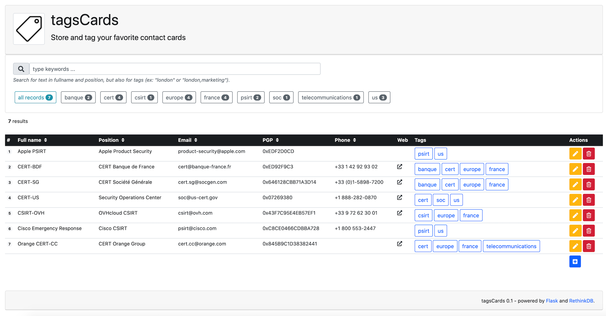
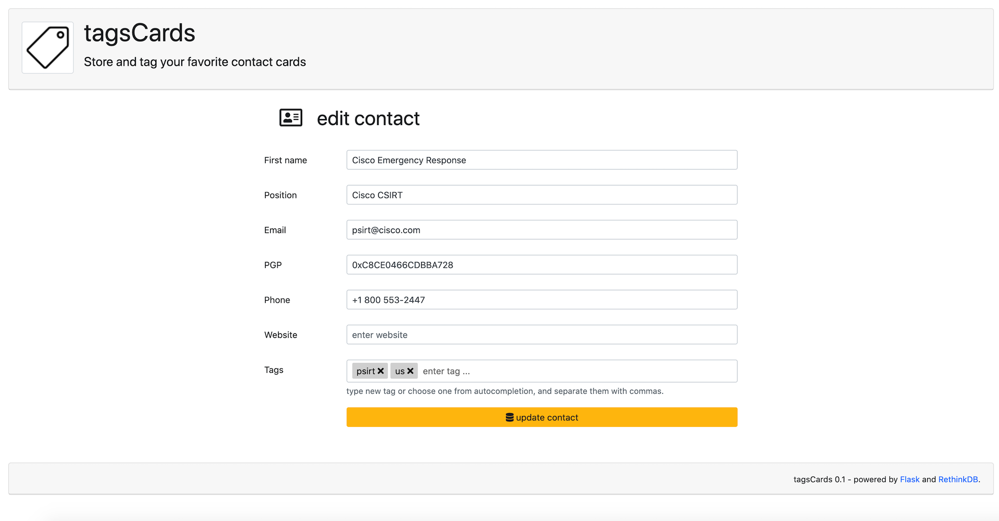
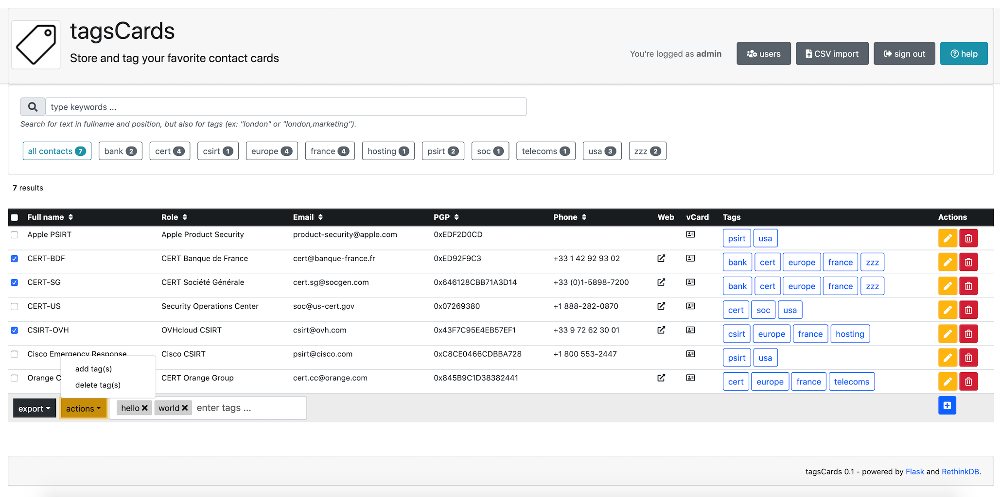

# tagscards
Store and tag your favorite contact cards

## Purpose 
Purpose of this very simple tool is to :
- create contact cards 
- store cards into database
- search for contacts using tags

## Requirements
Some modules are packaged with application :
- [Bootstrap 4](https://getbootstrap.com/)
- [Font Awesome](https://fontawesome.com/)
- [jQuery](https://jquery.com/)
- [Jquery Suggestags](https://github.com/amsify42/jquery.amsify.suggestags)

Following python modules are required :
- [Flask](https://flask.palletsprojects.com/)
- [RethinkDB](https://rethinkdb.com/)

Modules could be installed using following command:
```
$ pip install -r requirements.txt
```
## Database initialization
First, you will have to generate SHA-256 password from the user `admin`:
```
$ python3
>>> from werkzeug.security import generate_password_hash
>>> print( generate_password_hash("<your_admin_password>","sha256") )
sha256$rKuw19OQ$df9f3737a5d6310e3e35b2a987155c22d535d2cd6d6bd507a07b9d9b3b0dd6f3
```
Then, using RethinkDB Data Explorer (`http://localhost:8080/#dataexplorer`), you will initialize the database :
- create database `<your_database_name>`
- create table `contacts`
- create tables `users` (different than RethinkDB internal one)
- create user `admin`
```
r.dbCreate('<your_database_name>')

r.db('<your_database_name>).tableCreate('contacts')

r.db('<your_database_name>).tableCreate('users')

r.db('<your_database_name>).table('users').insert({
       username: 'admin', 
       password: '<your_hashed_password'
})
```
## Configuration
Settings have to be defined into `web/config.py` file :
```
...
# database
RETHINKDB_HOST = 'localhost'
RETHINKDB_PORT = 28015
RETHINKDB_BASE = '<your_database_name>'
...
```
## Run
Finally, run the flask server using following command:
```
$ ./manage.py --help
Usage: ./manage.py [options]

Options:
       -b, --bind=ADDRESS  bind to specific ip ADDRESS (default 0.0.0.0)
       -d, --debug         run in debug mode (default False)
       -h, --help          display this help and exit
       -p, --port=PORT     listen to specific PORT (default 8000)
       -t, --thread        run in threaded mode (default False)

$ ./manage.py --thread
```
## Some features
- Bootstrap 4 reqdy
- Tags input with auto-completion
- Admin user authentication
- Sorting on columns

## Todo list
- ~~bootstrap 4 integration~~
- ~~autocompletion for tags input~~
- ~~search with multiple tags~~
- ~~actions to add/edit/delete records~~
- ~~add PGP field~~
- ~~add position field~~
- ~~add website field~~
- ~~add sort asc/desc on fields~~
- ~~add icons support~~
- ~~fields text search support~~
- ~~login/logout functions~~
- ~~add session timeout~~
- manage pagination
- permissions to add/edit/delete records
- syntax check when editing fields
- pretty nice things to enhace interface
- export to vCards
- export for bulk mode
- ...

## Samples 




