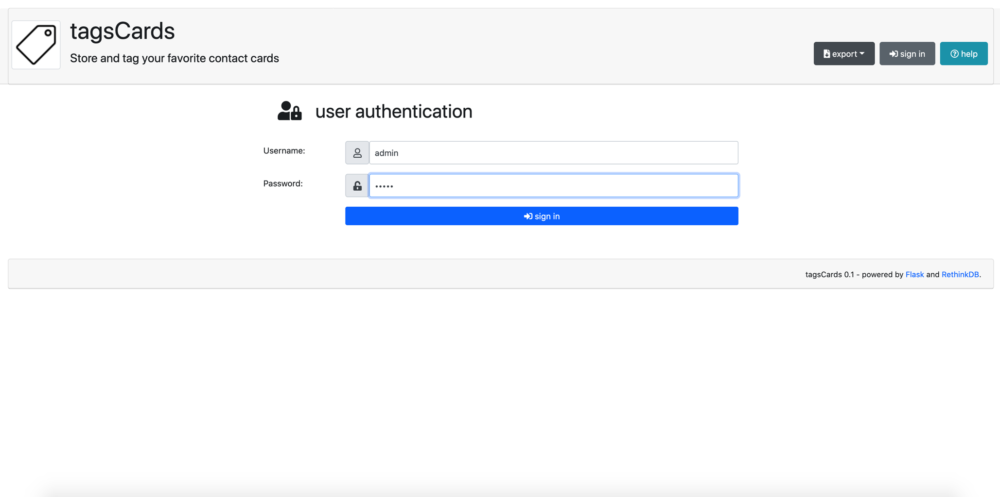

# tagscards
Store and tag your favorite contact cards

## Purpose 
Purpose of this very simple tool is to :
- create contact cards 
- store cards into database
- search for contacts using tags

## Requirements
Following python modules are required :
- [Flask](https://flask.palletsprojects.com/)
- [RethinkDB](https://rethinkdb.com/)

Modules could be installed using following commands:
```
$ pip install -r requirements.txt
```
## Configuration
Settings have to be defined into `config.py` file :
```
...
# database
RETHINKDB_HOST = 'localhost'
RETHINKDB_PORT = 28015
RETHINKDB_BASE = 'test'# enable/disable debug mode
...
```
## Samples 


