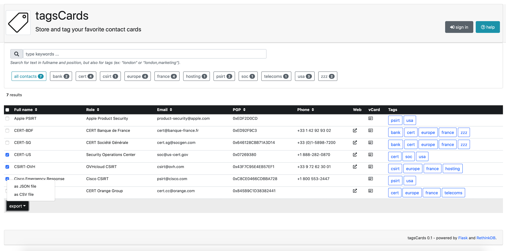
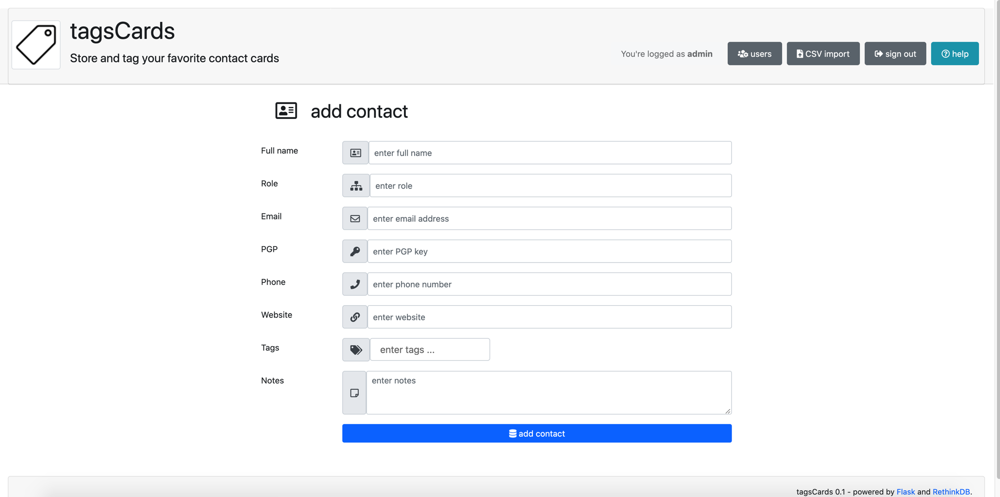
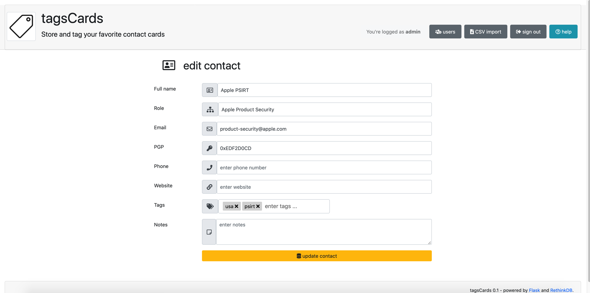
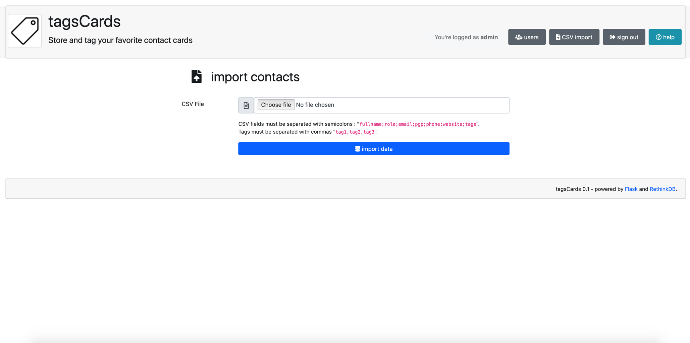

# tagscards
Store and tag your favorite contact cards

## Purpose 
Purpose of this very simple tool is to :
- create contact cards 
- store cards into database
- search for contacts using tags

## Requirements
Some modules are packaged with application :
- [Bootstrap 4](https://getbootstrap.com/)
- [Font Awesome](https://fontawesome.com/)
- [jQuery](https://jquery.com/)
- [Jquery Suggestags](https://github.com/amsify42/jquery.amsify.suggestags)

Following python modules are required :
- [Flask](https://flask.palletsprojects.com/)
- [RethinkDB](https://rethinkdb.com/)

Modules could be installed using following command:
```
$ pip install -r requirements.txt
```
## Database initialization
:warning: Following steps are now optional if you run `manage.py --init` (see section `Run`)

First, you will have to generate SHA-256 password from the user `admin`:
```
$ python3
>>> from werkzeug.security import generate_password_hash
>>> print( generate_password_hash("<your_admin_password>","sha256") )
sha256$rKuw19OQ$df9f3737a5d6310e3e35b2a987155c22d535d2cd6d6bd507a07b9d9b3b0dd6f3
```
Then, using RethinkDB Data Explorer (`http://localhost:8080/#dataexplorer`), you will initialize the database :
- create database `<your_database_name>`
- create table `contacts`
- create tables `users` (different than RethinkDB internal one)
- create user `admin`
```
r.dbCreate('<your_database_name>')

r.db('<your_database_name>).tableCreate('contacts')

r.db('<your_database_name>).tableCreate('users')

r.db('<your_database_name>).table('users').insert({
       username: 'admin', 
       email: '<your_email>',
       password: '<your_hashed_password'
})
```
## Configuration
Settings have to be defined into `web/config.py` file
```
...
# database
RETHINKDB_HOST = 'localhost'
RETHINKDB_PORT = 28015
RETHINKDB_BASE = '<your_database_name>'
...
```
## Run
Finally, use script `manage.py` ro init/run the flask server using following command:
```
$ ./manage.py --help
Usage: ./manage.py [options]

Options:
       -b, --bind=ADDRESS   bind to specific ip ADDRESS (default 0.0.0.0)
       -d, --debug          run in debug mode (default False)
       -i, --init           initialize database, tables and user admin
       -h, --help           display this help and exit
       -p, --port=PORT      listen to specific PORT (default 8000)
       -t, --thread         run in threaded mode (default False)

$ ./manage.py --init
[1/4] Database "test" created !
[2/4] Table "contacts" created !
[3/4] Table "users" created !
[4/4] User "admin" created !

$ ./manage.py --thread
```
## Import contacts
Contacts can be imported from CSV file:
- CSV file must contain one contact per line
- Each line must contain fields must be separated with semicolons
- Required fields are `fullname;role;email;pgp;phone;website;tags`
- Tags must be separated with commas `tag1,tag2,tag3`
```
Joe Smith;Unix Administrator;john.smith@company.com;0x12345678;11-22-33-44;http://github.com/;unix,admin
John Doe;Security Analyst;john.doe@company.com;0x12ABCDEF;55-66-77-88;http://github.com/;security,analyst
Foo Bar;Windows Administrator;foo.bar@company.com;0x98765432;12-34-56-78;http://github.com/;windows,admin
```
## Some features
- Bootstrap 4 reqdy
- Tags input with auto-completion
- Admin user authentication
- Sorting on columns
- Export as vCard
- Users management
- Import from CSV

## Todo list
- [x] bootstrap 4 integration
- [x] autocompletion for tags input
- [x] search with multiple tags
- [x] actions to add/edit/delete records
- [x] add PGP field
- [x] add position field
- [x] add website field
- [x] add sort asc/desc on fields
- [x] add icons support
- [x] fields text search support
- [x] login/logout functions
- [x] add session timeout
- [x] export as vCard format
- [x] add users management
- [x] export contacts as JSON file
- [x] export users as JSON file
- [x] import contacts from CSV file
- [x] manage flask messages
- [ ] manage pagination
- [ ] syntax check when editing fields
- [ ] pretty nice things to enhace interface
- [ ] export for bulk mode
- ...

## Samples 







